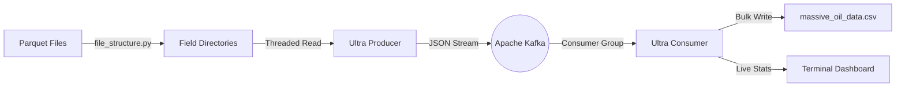

# kafka_oil_telemetry
A Dockerized real time simulation of oil field telemetry. 3W-Petrobas dataset used to produce streams into a live terminal dashboard and perform ETL. Built with Confluent Kafka and Pandas.



## About the Project

This project simulates a massive scale IoT environment where 50 oil fields of 22 wells each having total of 22 million rows , transmit sensor data simultaneously. It is designed to test high throughput data pipelines using Apache Kafka as the streaming backbone.

The system replays historical production data (originally in Parquet format), streams it through Kafka topics, and aggregates it into a single `massive_oil_data.csv` file for analysis, all while displaying real-time flow metrics in the terminal.

## Dataset & Transformation

### 1. The Source Data
The raw data consists of individual `.parquet` files representing specific oil wells in Petrobas offshore oil fields.
[https://www.kaggle.com/datasets/afrniomelo/3w-dataset]
[https://github.com/petrobras/3W]
[https://www.sciencedirect.com/science/article/pii/S0920410519306357?via%3Dihub]

### 2. "Well" to "Field" Transformation
Raw well data is flat and disorganized. Before simulation, the `file_structure.py` script reorganizes the data into logical "Oil Fields" to simulate a hierarchical IoT network.

* **Logic:** The script iterates through sorted Parquet files.
* **Grouping:** Every **22 wells** are grouped into one **Field** (e.g., `FIELD-01`, `FIELD-02`).
* **Renaming:** Files are standardized to `FIELD-XX_WELL-XXX_TIMESTAMP.parquet`.

This pre-processing step allows the producer to simulate entire fields coming online/offline rather than just random individual sensors.


## Architecture & Optimization

### The Pipeline

graph LR
    A[Parquet Data] --> B[Producer] --> C[(Kafka)] --> D[Consumer] --> E[CSV + Stats]

## Parallel Processing & Threading Algorithm

To realistically simulate ~50 oil fields transmitting data at the same time, a simple sequential loop is not sufficient. This project uses a **multi-threaded producer architecture** to model real-world distributed systems.

### Field-Level Concurrency

* The producer scans the `data/fields` directory for oil field folders.
* For **each field**, a dedicated Python thread is created using `threading.Thread`.
* Each thread independently streams data for all wells in its field.

This mirrors real deployments where **each physical oil field operates as an independent edge gateway** sending telemetry to the cloud.

### Scalability Model

* 1 field → 1 thread
* 50 fields → 50 concurrent threads

This design allows the system to scale linearly with the number of fields and accurately simulate parallel ingestion.

### Non-Blocking Startup

Before launching worker threads, the producer performs a lightweight TCP check (`wait_for_kafka`) to ensure the Kafka broker is reachable. This prevents wasted thread creation and startup failures when Kafka is not yet ready.

## Kafka Optimization Strategy

Both the Kafka **Producer** and **Consumer** are tuned for **high throughput** and low latency, which is critical for large scale telemetry replay.

### Producer-Side Optimizations

* **Batching (`batch.num.messages = 5000`)**
  Sensor readings are grouped into large batches, drastically reducing the number of network requests.

* **Linger Time (`linger.ms = 20`)**
  The producer waits up to 20 milliseconds to fill a batch before sending, improving compression efficiency and reducing CPU usage.

These two settings together allow Kafka to handle massive message volumes efficiently.

### Consumer-Side Optimizations

* **In-Memory Buffering**
  The consumer accumulates ~2,000 messages in memory before writing them to disk.

* **Bulk Disk Writes**
  Writing data in chunks avoids disk I/O bottlenecks and significantly improves performance when generating large CSV outputs.

## Getting Started

### Prerequisites

* Docker & Docker Compose
* Python 3.9+ (only required if running scripts locally)


### Installation

#### 1. Clone the Repository

```bash
git clone https://github.com/your-username/kafka-oil-telemetry.git
cd kafka-oil-telemetry
```

#### 2. Prepare the Data

Place your raw `.parquet` files into the `data/` directory, then run the structure script:

```bash
python scripts/file_structure.py
```

This organizes the data into the `data/fields` directory required by the producer.


### Run the Simulation

Start Kafka, the producer, and the consumer using Docker Compose:

```bash
docker-compose up --build
```


### View Results

* **Real-Time Metrics**: Watch the terminal output for live throughput statistics.
* **Final Output**: Aggregated results are written to:

  ```
  output/massive_oil_data.csv
  ```


## Project Structure

```plaintext
├── data/                  # Source Parquet files (mounted into Docker)
├── output/                # Generated CSV output
├── scripts/
│   ├── ultra_producer.py  # Multi-threaded Kafka producer
│   ├── ultra_consumer.py  # High-throughput Kafka consumer
│   ├── file_structure.py  # Organizes raw data into field folders
│   └── requirements.txt   # Python dependencies
├── Dockerfile             # Application container definition
└── docker-compose.yaml    # Kafka, Zookeeper, Producer, Consumer services
```

## License

Distributed under the **Apache License 2.0**. See the `LICENSE` file for more information.
